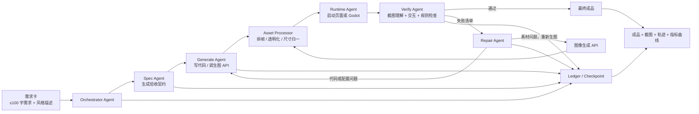
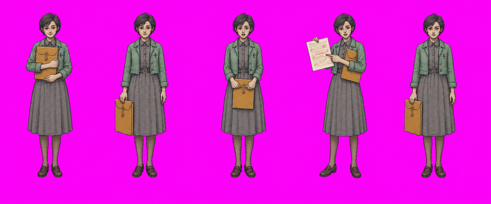
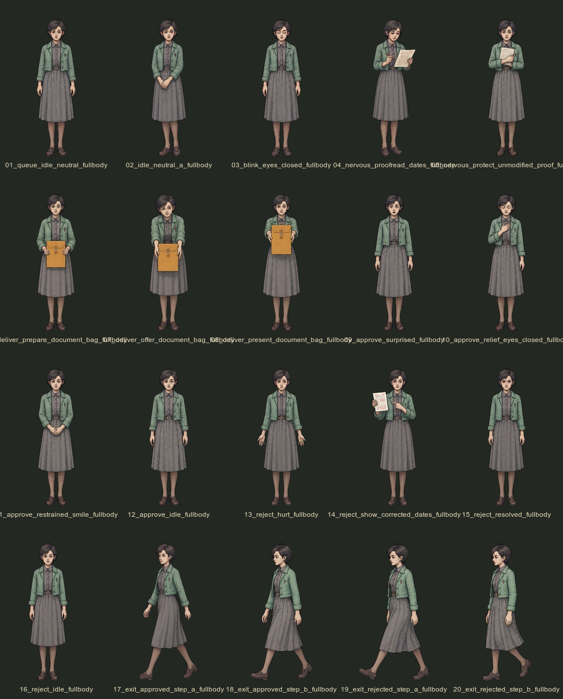
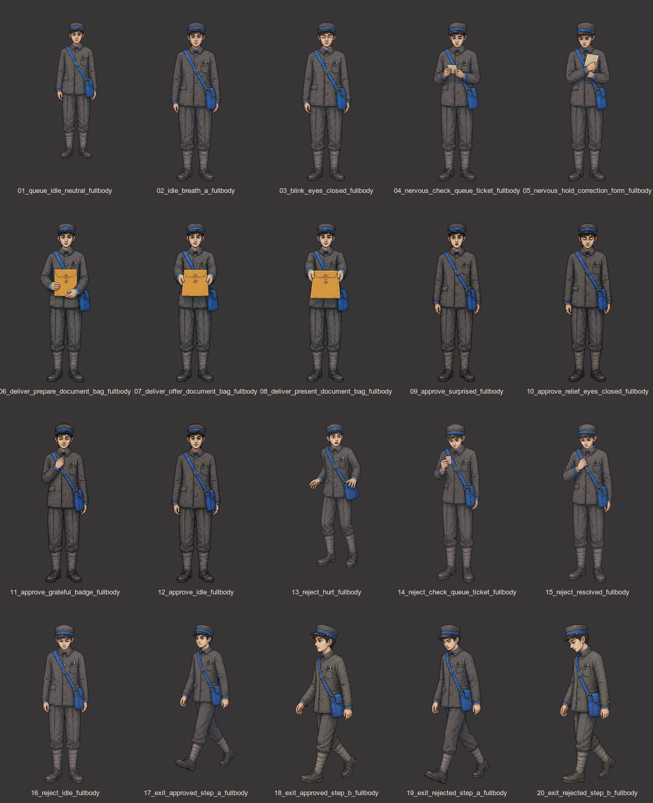
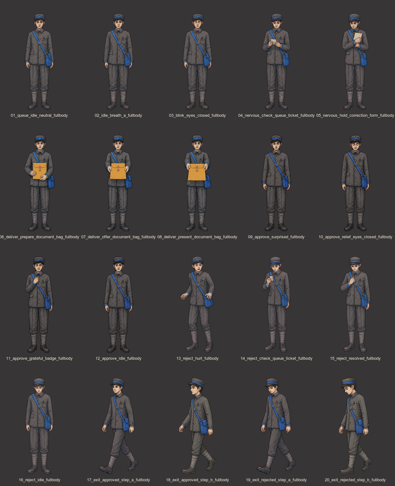

# 前端自进化工厂赛道回答草案

> 版本：人物图生成与动画验收实证版  
> 项目：FORMOCRACY NPC 人物资产流水线  
> 证据会话：`019f9364-f5b8-7d00-a851-cfe28d50c232`

## 0. 真实性说明

本文只把已经在人物资产生产中真实运行过的环节写成“已实现”：

- 已实现：角色规格拆解、图像生成、透明拆帧、像素级检查、多模态看图、Godot 导入、HTML 动检台、浏览器交互验收、问题分类和定向返工。
- 已实现：单个角色至少 3 轮的“生成—发现问题—修复—重新验收”轨迹。
- 尚未形成正式赛道证据：一张需求卡启动后，连续一小时完全无人干预的通用前端闭环。
- 当前原始会话虽然连续跨越 14 小时 43 分钟，但包含 186 条用户消息，不能冒充“无人值守一小时”。
- 当前仓库未配置 Git remote，也还没有正式演示视频链接。

因此，这是一份可以直接用于答辩结构和技术说明的实证草案；正式提交前仍需补跑一次合规的一小时无人值守任务，并补齐仓库 URL、指标曲线和演示视频。

---

## 1. 用一句话描述系统

输入一张人物或页面需求卡和一句风格约束，系统无人干预地完成规格拆解、代码与视觉素材生成、截图和交互验收、问题归因及定向返工，最终输出可运行成品、全部迭代证据和可复现的验收日志。

在 FORMOCRACY 的已实现人物流水线中，输入是“角色身份参考 + 动作语义 + 视觉规范”，输出是 20 张正式全身透明动画帧、11 动作配置、可运行的 Godot 角色和浏览器动检报告。

---

## 2. 系统由哪些 Agent 组成

| Agent | 角色 | 当前实现所用能力 | 主要产物 |
| --- | --- | --- | --- |
| Orchestrator Agent | 读取需求卡、拆任务、维持状态机、决定是否进入下一轮 | Codex / GPT-5 系列推理与代码能力；该证据日志末端记录为 GPT-5.3-Codex-Spark | `run.json`、任务状态、轮次路由 |
| Spec Agent | 把自然语言转成可验收契约，固定人物身份、动作、尺寸、道具生命周期和禁止项 | Codex / GPT-5 系列 | `acceptance_contract.json`、动作清单 |
| Generate Agent | 生成前端代码、人物动作条和页面视觉素材 | Codex + 图像生成 API | HTML/JS/GDScript、动作条、插画 |
| Asset Processor | 去色键、拆帧、连通域清理、统一画布和脚底基线 | Python/图像处理、确定性脚本 | 512×768 透明 PNG |
| Verify Agent | 独立读取需求和渲染证据，检查布局、语义、身份、风格、道具和动作连贯性 | 独立上下文的多模态模型 + 规则检查器 | 结构化问题清单、评分、证据图 |
| Runtime Agent | 启动 Godot/网页，用浏览器自动化点击、切动作、播放和读取控制台 | Godot headless + 浏览器自动化/Playwright 类能力 | 截图、交互日志、控制台日志 |
| Repair Agent | 根据失败类型选择“改代码、改配置、确定性修图或重新生图” | Codex / GPT-5 系列 + 图像生成 API | 最小修复补丁或局部重画 |
| Ledger/Checkpoint | 保存每轮输入、产物、指标、调用记录和恢复点 | JSONL、Task Tracer、文件哈希 | 完整迭代轨迹和断点 |

当前人物原型中，Generate、Verify、Runtime、Repair 已作为不同职责和不同上下文阶段运行。正式参赛版本会把 Verify Agent 固化为独立进程，禁止它读取 Generate Agent 的自我评价，只允许读取需求契约、成品、截图和运行证据。

### 架构简图



### 生图 API 接入位置

生图 API 不是只在第一轮调用，而是在三个位置接入：

1. 首轮素材生产：根据身份参考和动作契约生成 4～5 张横向动作条。
2. Verify 打回后的局部重画：只重画失败动作，不重做已经通过的素材。
3. 图像编辑：当错误是局部道具、手部或多余物件时，对原图进行定向编辑。

---

## 3. 人物图的“生成—验证—验收”闭环

### 3.1 需求先转为机器可验收的契约

人物图不会直接从一句“做个 NPC”开始生成。Spec Agent 先把需求转换为硬约束：

- 身份：年龄、职业、脸型、发型、服装、固定随身物。
- 动作：排队待机、呼吸、眨眼、紧张、递交、批准、驳回、两种离场。
- 技术：正式目录恰好 20 张、每张 512×768、透明 PNG、头脚完整。
- 锚点：所有帧脚底在同一基线，人物可见高度处于允许误差内。
- 运行协议：11 个动作、最高 4 FPS、LOOP/ONCE/HOLD 行为正确。
- 道具语义：任务文件袋只在 `06–08 deliver` 出现，交付后归工作台所有。
- 禁止项：不裁成半身、不残留色键、不出现相邻格碎片、不在离场帧重新携带已交付道具。

契约把“好不好看”拆成机器可检查项和需要多模态判断的主观项，减少 Verify Agent 只给模糊意见。

### 3.2 批量生成而不是逐帧盲抽

人物生产采用“4～5 张动作条 × 每条 3～5 个姿势”，而不是调用 20 次互相独立的单帧生成：

- 身份一致性更高，脸、服装、身体比例不容易逐帧漂移。
- 调用次数从约 20 次降为 4～5 次。
- Verify Agent 可以先对整条动作的叙事连续性做判断。
- 不合格时只补一条或一两个姿势。

### 3.3 确定性资产处理

图像生成后，Asset Processor 自动执行：

1. 去除绿色或洋红色键背景。
2. 用最大连通域排除相邻人物的鞋尖、帽檐等碎片。
3. 拆分每个姿势，禁止简单数学等分导致跨格。
4. 放入统一的 512×768 透明画布。
5. 测量非透明人物包围盒高度。
6. 将脚底对齐到统一基线。
7. 输出 20 帧 contact sheet 和逐帧审计 JSON。

### 3.4 Verify Agent 的多模态验收

Verify Agent 同时看四类证据：

- 角色参考图与 20 帧总览：判断身份、服装、年龄和风格是否一致。
- 单动作播放截图：判断动作是不是“真变化”，而不是同一姿势复制。
- 页面或 Godot 实机截图：判断人物比例、遮挡层级和构图是否正确。
- 结构化数据：检查尺寸、Alpha、可见高度、脚底基线、动作数、帧数、FPS 和资源路径。

### 3.5 浏览器和运行时验收

自动化浏览器会实际打开动画实验室并执行：

- 选择人物。
- 切换 `deliver`、`angry_react`、`exit_rejected` 等动作。
- 点击播放、暂停、逐帧前进。
- 检查 `20 / 20`、协议“符合”、资源错误 `0`。
- 检查 HOLD 动作是否停在末帧、离场动作是否循环。
- 读取浏览器 warning/error。

Godot 侧同时执行资源导入、动画库测试、播放器测试、NPC 排队/补位流程和实际渲染快照。

### 3.6 结构化打回

Verify Agent 不返回“感觉不对”，而是返回类似以下结构：

```json
{
  "decision": "reject",
  "failure_class": "asset_semantics",
  "asset_ids": ["13_reject_hurt", "17_exit_approved_step_a"],
  "evidence": {
    "requirement": "文件袋在交付后归工作台",
    "observed": "人物在驳回和离场帧仍携带文件袋"
  },
  "repair_route": "regenerate_assets",
  "preserve": ["identity", "clothing", "palette", "approved_frames"],
  "next_checks": ["bag_lifecycle", "identity_consistency", "runtime_import"]
}
```

Repair Agent 根据 `failure_class` 自动选择路线：

- `layout` / `interaction`：改代码。
- `asset_semantics` / `style_mismatch`：重新生图或图像编辑。
- `scale` / `baseline` / `alpha`：优先确定性修图。
- `runtime_mapping`：改配置或资源引用。

---

## 4. Verify Agent 成功发现并推动修复的两个真实问题

### 案例一：沈青禾的文件袋在交付后仍跟着人物走

#### 问题

首轮提示把“文件袋造型一致”写得过强，生成结果让人物在批准、驳回和离场动作中仍携带文件袋。单帧看上去没有技术错误，但它违反了游戏叙事：文件袋在递交动作完成后已经转移到玩家工作台。

这是典型的“素材很漂亮，但语义不对”问题，Lint、尺寸检查和单元测试都发现不了。

#### Verify 结论

- 失败类别：`asset_semantics / prop_lifecycle`
- 修复路线：重新生图
- 保留项：人物身份、服装、颜色、动作情绪
- 重新生成项：批准、驳回和离场相关帧
- 新系统规则：只有 `06–08 deliver` 可以出现文件袋；驳回举证最多出现一张散页

#### 前后对比

首轮动作条中，道具被错误地当作人物常驻属性：



定向重画并重新拆帧后，文件袋只在递交三帧出现，后续动作空手：



#### 修复结果

- 3 次定向修图调用，没有重画已通过的身份和递交素材。
- 正式目录恰好 20 张。
- `deliver` 3 帧出现文件袋。
- `angry_react` 只保留情绪和一张散页。
- 两种离场动作都不再携带文件袋。
- Godot 导入 `20 / 20`，动画实验室资源错误 `0`。

### 案例二：唐霁三张帧尺寸相同，但人物播放时会突然跳缩

#### 问题

所有 PNG 都是 512×768，因此普通“图片尺寸检查”会判定通过；但 Verify Agent 对 contact sheet 和实际播放进行比对后发现人物在部分动作中明显变小。

确定性测量定位到三张异常帧：

- `01`：人物可见高度 583px。
- `13`：人物可见高度 618px。
- `17`：人物可见高度 628px。
- 正常目标高度：680px。

#### Verify 结论

- 失败类别：`asset_geometry / scale_drift`
- 修复路线：确定性归一化，不重新调用生图 API
- 约束：保持人物比例，统一可见高度 680px，脚底统一到 `y=752`

#### 前后对比





#### 修复结果

- 尺度一致帧从 `17 / 20` 提升到 `20 / 20`。
- 三张异常帧全部归一到 680px。
- 20 帧脚底统一到 `y=752`。
- 动画实验室实际播放不再发生人物跳缩。
- 该问题没有消耗新的生图调用。

---

## 5. 一次 ≥3 轮的真实闭环轨迹

以下是唐霁人物资产的一次真实四轮收敛过程：

| 轮次 | Generate / Repair | Verify 发现 | 自动路由 | 结果 |
| --- | --- | --- | --- | --- |
| Round 1 | 生成待机、递交、批准、驳回、离场五组动作条 | 两张离场姿势是同一只脚在前，视觉上是假走路 | `asset_motion → regenerate` | 只补离场反向步 |
| Round 2 | 生成两组补充步态帧并选出正式 20 张 | contact sheet 显示 3 张人物尺度偏小 | `asset_geometry → deterministic_fix` | 583/618/628px 统一到 680px |
| Round 3 | 重新构建 contact sheet 和动作配置 | 静态指标全部通过，但仍需确认播放时无跳缩 | `runtime_visual → browser_verify` | 浏览器实际播放通过 |
| Round 4 | 不再改图，执行 Godot 和动检台验收 | 20/20、11 动作、最高 4 FPS、资源错误 0 | `pass` | 生成正式产物和验收摘要 |

### 可见的收敛指标

| 指标 | Round 1 | Round 2 | Round 3/4 |
| --- | ---: | ---: | ---: |
| 人物尺度一致帧 | 未量化 | 17/20，85% | 20/20，100% |
| 脚底基线一致 | 未量化 | 发现漂移 | 20/20，100% |
| 离场步态区分 | 失败 | 通过 | 通过 |
| Godot 资源导入 | 未执行 | 未执行 | 20/20 |
| 浏览器资源错误 | 未执行 | 未执行 | 0 |
| 动作协议 | 未执行 | 未执行 | 11 动作，符合 |

这条轨迹证明闭环机制能连续执行超过 3 轮，但原始会话中仍有人类在角色之间发送“下一位”等消息。正式比赛提交必须由同一份需求卡自动启动并复跑，才能满足严格的“轮次之间完全无人干预”要求。

---

## 6. 一小时长跑日志、指标曲线与生图调用摘要

### 6.1 当前已有的真实运行记录

原始 Codex JSONL：

```text
/Users/amin/.codex/sessions/2026/07/24/
rollout-2026-07-24T17-11-35-019f9364-f5b8-7d00-a851-cfe28d50c232.jsonl
```

日志统计：

| 项目 | 数值 |
| --- | ---: |
| 会话跨度 | 14 小时 43 分 10 秒 |
| JSONL 记录 | 9,787 |
| 用户消息 | 186 |
| Assistant 消息 | 374 |
| 生图 API 调用 | 51 |
| 图像查看/验收调用 | 91 |

这份日志能证明系统经历过长时间、多角色连续生产和大量恢复操作，但因为存在用户消息，不能作为赛道要求的“一小时无人值守”最终证据。

### 6.2 生图 API 调用用途分布

| 用途 | 次数 | 占比 |
| --- | ---: | ---: |
| 人物基础动作条 | 42 | 82.4% |
| Verify 打回后的定向修图 | 8 | 15.7% |
| 场景背景图 | 1 | 2.0% |
| 合计 | 51 | 100% |

定向修图的真实分布包括：

- 沈青禾：4 次基础生成 + 3 次去文件袋纠正。
- 唐霁：5 次基础生成 + 2 次离场步态纠正。
- 罗雨棠：5 次基础生成 + 3 次步态/手持物纠正。

### 6.3 正式提交前需要补跑的合规长跑

正式跑次应满足：

```text
runs/<run-id>/
├── requirement-card.json
├── acceptance-contract.json
├── events.jsonl
├── imagegen-calls.jsonl
├── metrics.csv
├── round-001/
│   ├── screenshot.png
│   ├── verify.json
│   └── change-summary.md
├── round-002/
├── round-003/
└── final/
    ├── screenshot.png
    ├── artifact/
    └── final-report.md
```

至少记录以下曲线：

- `requirement_coverage`
- `asset_relevance_score`
- `style_consistency_score`
- `layout_score`
- `interaction_pass_rate`
- `technical_asset_pass_rate`
- `open_issue_count`
- `cumulative_tokens`
- `cumulative_image_calls`
- `estimated_cost`

正式证据应提供开始/结束时间、心跳、每轮决策、崩溃恢复点和最终 SHA，保证不是事后拼接日志。

---

## 7. 长跑过程中最严重的一次“翻车”

### 翻车：局部视觉问题把系统带向了错误架构

人物在柜台后露出腿部时，系统曾把问题错误归因成“人物素材应该裁成半身”，并一度在运行时裁切完整全身帧。这样虽然让当前截图看起来正确，却破坏了用户的核心目标：人物资源必须保持完整全身，遮挡应该由桌台和围栏的真实前景层完成。

这是典型的目标漂移：

- 局部指标“截图不露腿”上升。
- 全局约束“人物资源完整”被牺牲。
- 如果只看最后一张截图，Verify Agent 甚至可能误判通过。

### 工程解决

1. 把“不裁人物”写成不可被 Repair Agent 改写的硬契约。
2. 技术验收增加“运行时纹理不是 AtlasTexture 裁切”的断言。
3. 视觉层级改为“完整人物 → 桌台前景 → 独立围栏”。
4. 原始资源和每轮产物保留可恢复备份，不做不可逆覆盖。
5. 每次修复必须同时回归硬契约和本轮目标，禁止只优化单张截图。

### 选择解决的两个长程运行难题

#### 1. 上下文/记忆管理与防目标漂移

- 不依赖聊天上下文记住规则，而是写入版本化验收契约。
- 每个角色保存身份参考、动作表、道具生命周期和禁止项。
- Verify Agent 每轮重新读取契约，不继承 Generate Agent 的自我判断。
- 已通过的要求进入 `locked_invariants`，Repair Agent 不得修改。

#### 2. 断点续跑与幂等

- 每个角色拆成“身份审计—生成—拆帧—接入—验证”独立任务。
- 每轮产物进入独立目录并带哈希；完成项不会因为重启再次生图。
- Task Tracer 记录 pending/in_progress/completed 和结果摘要。
- 生图前先检查 idempotency key 和目标文件，避免恢复后重复烧调用。
- 原图和替换前资源移入可恢复备份，而不是直接删除。

额外解决的第三项是成本控制：优先确定性修图，其次局部重画，最后才是整组重画。

---

## 8. Token、生图调用和成本控制

### 8.1 当前日志中的真实用量

会话末端 token 计数器记录：

| 项目 | 数值 |
| --- | ---: |
| 输入 token（含缓存） | 234,112,540 |
| 其中缓存输入 | 220,744,448 |
| 非缓存输入约 | 13,368,092 |
| 输出 token | 597,324 |
| 其中 reasoning output | 151,933 |
| 生图 API 调用 | 51 |

注意：

- 这是一个跨 14 小时、多角色、多轮工具调用的大型开发会话，不是单张需求卡的成本。
- 本地日志没有记录模型和生图 API 的单价，所以不能诚实给出美元总价。
- 正式系统应在每次 API 响应旁记录模型名、计费单位、缓存命中和估算金额，再按 run 汇总。

### 8.2 成本控制策略

1. 以动作条代替 20 次单帧生成，单角色基础调用控制在 4～5 次。
2. 先做便宜的确定性检查，再调用昂贵的多模态 Verify。
3. 尺度、透明度、基线和碎片问题用脚本修，不重新生图。
4. 只重画失败动作，锁定已通过素材。
5. 对输入参考和输出图做哈希去重。
6. 设置每卡最大轮数、最大生图次数和预算上限。
7. 连续两轮同类失败时触发“策略升级”，而不是原提示词死循环重试。
8. 使用摘要化状态和外部契约，避免每轮把全部历史重新塞入模型。

---

## 9. 系统最容易在哪类需求卡上失败

### 容易失败的需求

- 风格描述高度主观，如“高级一点、松弛一点、像某品牌但不能像”。
- 需要在生成图片中正确绘制大量文字、表格或精确图标。
- 同一角色需要多角度、多服装、多场景仍保持严格身份一致。
- 页面交互依赖第三方登录、支付、摄像头或不可控网络服务。
- 需求本身互相矛盾，例如既要求极简，又要求首页展示大量功能和说明。
- 响应式页面需要同时在多种屏幕尺寸保持复杂插画构图。

### 瓶颈判断

| 瓶颈 | 具体表现 |
| --- | --- |
| 模型能力 | 风格评分不稳定，容易把“好看”误当成“符合需求” |
| 生图 API | 身份一致性、手部、道具生命周期、指定局部修改仍可能漂移 |
| 工程设计 | 浏览器状态、异步动画、外部服务和长跑恢复容易产生假失败 |

当前最大的瓶颈不是单一模型，而是“可验证需求表达”：如果 Spec Agent 没有把道具归属、禁止项和交互结果写成契约，再强的 Verify Agent 也可能只看到一张漂亮截图。

### 对生图 API 的改进建议

1. 支持稳定的角色 identity embedding，并允许跨多次调用复用。
2. 提供参考图强度、姿势强度、服装锁定和道具锁定的独立参数。
3. 原生支持透明背景和多格 sprite strip 输出。
4. 支持 mask/inpainting，只修改指定区域而不重绘整个人物。
5. 返回 seed、模型版本、耗时、计费和安全处理信息。
6. 支持“保持人物，删除道具”之类结构化编辑指令。
7. 输出分层结果，例如人物层、道具层、背景层，方便自动验收和替换。

---

## 10. 语音 API（选答）

当前人物图生成与验证闭环没有使用 ASR/TTS，因此不把语音能力写成已实现加分项。

如果接入，最自然的用途不是用语音替代日志，而是：

- 长跑超过阈值或进入连续失败时，用 TTS 播报简短状态。
- 演示视频中自动朗读每轮“发现了什么、为什么改代码或重画图”。
- 用 ASR 把现场评委的口头需求转成需求卡，但仍需显示文字确认，避免语音误识别污染无人闭环。

---

## 11. 仓库、一键运行与演示视频

### 仓库地址

当前本地仓库没有配置 Git remote。正式提交前补充：

```text
https://github.com/<organization>/<repository>
```

### 当前原型运行

安装依赖：

```bash
uv sync --dev
```

启动人物动画实验室：

```bash
make animation-lab
```

打开：

```text
http://127.0.0.1:4173/tools/npc-animation-lab/
```

运行 Godot：

```bash
godot --path .
```

执行现有质量检查：

```bash
make quality
```

正式赛道版还需要增加真正的一键入口，例如：

```bash
./run-factory --card examples/tomato-timer.json --min-runtime 3600
```

该入口应自动完成环境检查、生成、浏览器启动、至少三轮闭环、心跳、断点恢复、指标导出和最终打包。

### 三分钟演示视频结构

当前尚无正式视频链接。建议脚本：

1. `0:00–0:20`：投喂一张需求卡，展示无人操作开始。
2. `0:20–0:50`：Generate Agent 写页面并调用生图 API。
3. `0:50–1:20`：Verify Agent 截图、点击和输出结构化失败清单。
4. `1:20–1:50`：展示沈青禾文件袋被打回重画的前后对比。
5. `1:50–2:15`：展示唐霁尺度 85%→100% 和实际播放。
6. `2:15–2:40`：展示三轮以上轨迹、指标曲线和一小时心跳日志。
7. `2:40–3:00`：展示最终网页、产物目录和一键复现命令。

---

## 12. 对评选标准的对应关系

| 评选项 | 当前已证明 | 正式提交前需补 |
| --- | --- | --- |
| 闭环完整度 30% | 生图、拆帧、视觉验收、浏览器验收、重画和重新验证 | 通用网页需求卡的一键无人闭环 |
| 自验收智能程度 25% | 身份、动作、道具语义、尺度、Alpha、运行播放和控制台 | 页面布局和响应式评分标定 |
| 长跑稳定性 25% | 14h43m 长会话、任务检查点、资源备份和幂等思路 | 合规的一小时零人工日志与真实曲线 |
| 盲测与质感 20% | 多角色未见动作的连续生产和定向修图 | 现场盲卡的端到端网页结果 |

## 最终陈述

这个原型最有价值的地方，不是“AI 能一次画出 20 张图”，而是它已经证明了三件事：

1. Verify 可以发现传统测试发现不了的语义错误，例如“道具已经交付，却还跟着人物离场”。
2. 修复不必永远重新生图；系统能区分语义重画和确定性几何修复。
3. 验收不是一句“看起来不错”，而是可以落实为 contact sheet、像素指标、浏览器交互、Godot 运行和结构化证据。

正式赛道版本需要做的最后一步，是把当前由对话驱动的各个成熟环节封装成一个真正无人值守的一键状态机，并用一小时零人工日志证明它能够持续收敛。
