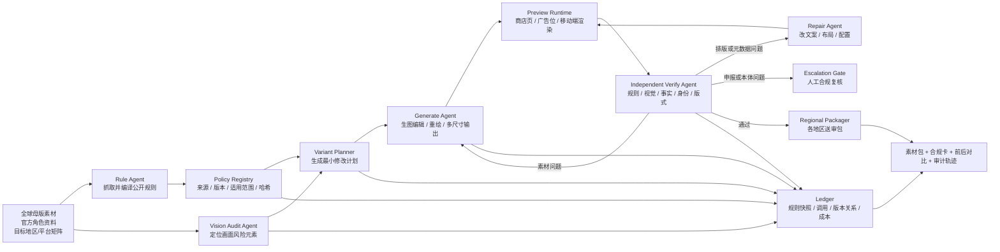

# 【原神 / 崩坏：星穹铁道 / 绝区零】Gate42：全球发行素材合规变体与自验收 Agent

> Gate42 参赛方案重写版
>
> 现场主 Demo 建议选择：《原神》角色版本素材
>
> 核心约束：42 天版本周期 × 全球同步发行 × 地区/平台审核差异
>
> 官方赛道说明：[米哈游赛道指导文档](https://my.feishu.cn/wiki/NokowacmdiMvQgkUEs2cTstBnBb?sheet=470559)

---

## 0. 一句话描述

输入一套全球发行母版素材、目标地区和投放平台，Gate42 会读取公开审核与评级规则，自动识别每个地区的风险点、生成最小差异的合规视觉版本、通过多模态与商店页预览反复验收，最终输出按地区可送审的素材包、修改依据和完整审计轨迹。

路演版一句话：

> **一套母版进去，自动长出能穿过全球不同审核闸门的素材家族。**

---

# 第一部分：一页说明

## 1. 我们解的具体问题

一款游戏每 42 天上线一个新版本。每个新角色、活动和版本都要同步生产：

- App Store / Google Play 商店截图与 Feature Graphic；
- 版本 Key Visual、角色海报和预告封面；
- 多语言官网、社媒和广告素材；
- 不同评级体系下需要展示的分级标识与内容说明。

真正困难的不是把同一张图翻译成多种语言，而是：

> **同一张全球母版素材，不一定能原样通过每个地区、每个平台和每个投放位置的审核。**

某个画面在游戏内符合既有评级，不代表它适合出现在面向一般受众的商店截图中；武器指向、血液表现、服装暴露、恐怖元素、赌博暗示、生成图中的文字、评级标识和促销用语，都可能在不同平台规则或地区评级体系下得到不同处理。

在 42 天周期里，规则还会更新。等到送审时才发现问题，意味着设计、法务、本地化、发行和开发一起返工；一个地区卡住，就可能破坏全球同步节奏。

## 2. 一周目：现在怎么做

```text
全球团队确定母版
→ 各区域领取素材
→ 本地化与合规人员人工读规则
→ 人工检查图片和文案
→ 设计师逐地区修改
→ 送审
→ 被拒后根据模糊反馈再次返工
```

这个流程有四个现实瓶颈：

1. **规则分散且持续变化**：平台政策、评级机构说明和地区要求存在于不同网站。
2. **人工检查难以穷举**：一张母版乘以多个地区、语言、商店和尺寸，会迅速变成上百个交付物。
3. **返工粒度过大**：设计师常常重做整张图，而不是只修改触发风险的局部元素。
4. **经验难以沉淀**：为什么改、依据哪条规则、哪一版送到哪里，通常散落在聊天和表格中。

## 3. 二周目：Gate42 的质变

Gate42 把“全球素材送审”变成一个可以自动编译和回归测试的过程：

```text
全球母版 + 目标市场矩阵
→ 公开规则编译
→ 多模态风险定位
→ 自动生成地区变体
→ 商店页/广告位真实预览
→ 独立 Verify Agent 验收
→ 自动局部重画或改版
→ 地区送审包 + 规则证据 + 版本关系图
```

它不是让 AI 猜“什么图比较安全”，而是把公开规则转换为带来源、版本和适用范围的机器验收契约。

当系统发现问题时，会先判断问题属于哪一层：

| 问题层级 | 例子 | Gate42 的处理 |
| --- | --- | --- |
| 素材可修 | 血液、武器指向、暴露程度、错误评级标识、图片文字溢出 | 局部编辑或重新生图 |
| 元数据可修 | 促销词、语言、描述、截图排序、标识位置 | 修改文案或页面配置 |
| 申报需更新 | 新版本新增了会影响评级的内容 | 标红并要求重新完成正式评级问卷 |
| 游戏本体问题 | 内容本身可能违反当地法律或平台政策 | **停止，不用换图掩盖，升级给合规人员** |

质变点是：

> 过去只能等各地区逐个检查、逐个打回；现在可以在送审前自动生成并验证一个有共同血缘、差异最小、依据可追溯的全球素材家族。

## 4. 现场 Demo

现场输入：

- 一张角色 Key Visual 母版；
- 一个官方角色/版本公开页面；
- 三个投放目标，例如：
  - Apple App Store 商店截图；
  - Google Play Feature Graphic；
  - 德国区版本预告素材；
- 最大三轮与固定生图预算。

系统现场完成：

1. 展示三个目标对应的公开规则卡；
2. 多模态识别母版中的武器指向、血液、服装、文字和评级标识；
3. 判断哪些元素需要修改、哪些必须保留；
4. 调用生图 API，一次生成多个最小差异版本；
5. 放进真实尺寸的商店页和移动端预览中；
6. Verify Agent 发现一版仍有风险，自动局部重画；
7. 输出三个可下载素材包、前后对比、规则引用和修改日志。

---

# 第二部分：为什么这个问题真实存在

## 5. 公开规则证据

以下规则快照核对时间为 **2026-07-25**。正式系统会保留抓取时间、原文片段、URL 和内容哈希，并在规则变化时重新编译。

### 5.1 Apple：游戏评级更高，不代表商店素材可以同样激烈

[Apple App Review Guidelines](https://developer.apple.com/app-store/review/guidelines/) 的 2.3.8 明确要求元数据适合所有受众。即使游戏本身评级更高，图标、截图和预览也应遵守相应标准；Apple 给出的例子包括不要在游戏商店素材中展示惨烈死亡或枪口指向具体角色。

同一份规则还要求：

- 元数据完整、准确；
- 截图和预览不能误导；
- 不应出现无法验证的产品宣称；
- 应遵守上架所在地的法律要求。

这证明“游戏内可以出现”与“商店素材可以展示”是两个不同的验收问题。

### 5.2 Google Play：商店页要面向一般受众

[Google Play 商店页最佳实践](https://support.google.com/googleplay/android-developer/answer/13393723?hl=en) 要求商店页适合一般受众，并明确提醒避免在商店描述或图片中展示露骨暴力；带文字的截图应为支持的语言提供独立版本，所有翻译同样受元数据政策约束。

[Google Play 预览素材规范](https://support.google.com/googleplay/android-developer/answer/9866151?hl=en) 还规定了图标、Feature Graphic、截图的尺寸、文件格式和内容要求。素材可能在多种 Google 展示位置被复用，因此一张只在单一页面看起来正确的图片，到了另一个裁切比例中可能文字被截断或关键元素越界。

### 5.3 同一款游戏在不同地区可能得到不同评级

[IARC 官方说明](https://globalratings.com/about/) 表明，其统一问卷会依据各参与评级机构的本地标准，为不同地区生成各自的年龄评级、内容描述和互动元素。

[IARC 参与机构](https://globalratings.com/participants/) 包括北美 ESRB、欧洲 PEGI、德国 USK、韩国 GRAC、澳大利亚 Classification Board、巴西 ClassInd 等。

[Google Play 内容评级说明](https://support.google.com/googleplay/android-developer/answer/9859655?hl=en) 也明确指出：不同地区的评级标准存在差异，同一个应用可以在不同地区获得不同评级；内容变化影响原问卷答案时，需要重新提交评级问卷。

### 5.4 评级和广告/预告素材不是随便贴一个标识

[ESRB 评级指南](https://www.esrb.org/ratings-guide/) 将评级分为年龄类别、内容描述和互动元素；随机道具购买、用户互动等信息也有独立披露方式。

[德国 USK 分类程序](https://usk.de/en/home/age-classification-for-games-and-apps/types-of-classification-procedures/) 说明，不同发布方式对应不同分类流程，预告片、展会展示、实体与数字发行也可能处于不同程序中。

因此 Gate42 不能只保存“德国 = 某个年龄数字”这种静态映射，而要知道：

```text
地区 × 平台 × 素材类型 × 当前版本 × 评级状态
```

## 6. Gate42 不做什么

Gate42 是**送审前合规预检与素材变体系统**，不是法律意见，也不承诺平台必然批准。

系统禁止：

- 通过替换宣传图隐瞒游戏真实内容；
- 自动降低或伪造官方年龄评级；
- 使用错误的评级标识；
- 在申报问卷中弱化、遗漏或虚报内容；
- 把“高风险”误写成“违法”；
- 把某地区的文化刻板印象当作审核规则；
- 绕过正式审核、申诉或评级机构。

如果风险来自游戏本体，系统必须输出：

```json
{
  "decision": "escalate",
  "reason": "build_level_or_rating_declaration_issue",
  "automatic_asset_repair_allowed": false,
  "required_owner": "legal_or_regional_compliance"
}
```

这一边界不是缺点，而是可信度的核心。

---

# 第三部分：方案选择

## 7. 三个方向与取舍

| 方向 | 做什么 | 优点 | 风险 | 结论 |
| --- | --- | --- | --- | --- |
| **A. 全球商店与宣发素材合规变体工厂** | 从一套母版生成不同地区、平台和尺寸的最小差异版本 | 痛点集中；生图能力成为核心；现场前后对比强；能在 42 天内落地 | 不能声称“保证过审” | **推荐** |
| B. 游戏本体内容区域化编译器 | 自动修改角色服装、特效、场景和剧情资产 | 想象空间最大 | 极易涉及本体逻辑、法律判断和版本分叉，比赛范围过大 | 暂不做 |
| C. 全球审核规则监控 Agent | 监控规则变化并通知相关团队 | 稳定、实用、容易可信 | 更像知识库和自动化，无法发挥现有批量生图与自验收优势 | 作为 Gate42 的底层模块 |

最终聚焦 A，把 C 作为规则输入，不在首个 Demo 中修改游戏本体。

---

# 第四部分：系统架构

## 8. 架构简图



## 9. Agent 组成

| Agent | 职责 | 建议能力 | 产物 |
| --- | --- | --- | --- |
| Orchestrator | 驱动三轮闭环、预算、断点与停止条件 | 强推理 Agent 模型 | `run.json`、状态机 |
| Rule Agent | 抓取公开规则，识别更新并转换成验收契约 | 检索 + 文本模型 | `policy-registry.jsonl` |
| Vision Audit Agent | 识别血液、武器、暴露、恐怖、文字、标识和构图关系 | 多模态模型 + OCR + 检测器 | 带坐标的风险清单 |
| Variant Planner | 判断保留项、修改项和目标版本数量 | 推理模型 | 最小编辑计划与继承图 |
| Generate Agent | 调用生图 API 局部编辑或重画 | 生图/图像编辑 API | 多地区视觉变体 |
| Preview Runtime | 把素材放入目标商店与广告位尺寸预览 | HTML + 浏览器自动化 | 桌面/移动截图 |
| **Verify Agent** | 独立核对规则、角色身份、修改充分性和误导风险 | 独立多模态模型 + 硬规则 | `verify.json` |
| Repair Agent | 修文案、裁切、安全区和元数据配置 | 代码/推理模型 | 最小补丁 |
| Regional Packager | 导出命名、尺寸、语言和标识正确的包 | 确定性脚本 | ZIP、manifest、合规卡 |
| Ledger | 保存每轮证据、规则版本、调用与成本 | JSONL/SQLite + 哈希 | 完整审计轨迹 |

## 10. Rule Agent 如何避免“凭印象审查”

每条规则不是一句孤立的自然语言，而是：

```json
{
  "rule_id": "apple-app-review-2.3.8",
  "source_url": "https://developer.apple.com/app-store/review/guidelines/",
  "captured_at": "2026-07-25T12:00:00+08:00",
  "applies_to": {
    "platform": "apple-app-store",
    "placements": ["icon", "screenshot", "preview"],
    "regions": ["global"]
  },
  "check_type": "multimodal",
  "summary": "商店元数据应适合所有受众",
  "examples": [
    "避免展示惨烈死亡",
    "避免枪口指向具体角色"
  ],
  "severity": "blocking_candidate",
  "content_hash": "sha256:...",
  "requires_human_interpretation": true
}
```

关键设计：

- **规则有时效性**：每次运行记录抓取时间和哈希。
- **规则有适用范围**：不能把 Apple 的商店页规则误套到游戏内。
- **规则有解释空间**：模型只输出风险与证据，不擅自宣布违法。
- **规则可失效**：来源变化时旧结论自动进入待复核。
- **规则有优先级**：法律/评级升级 > 平台硬要求 > 推荐项。

---

# 第五部分：生成与验证闭环

## 11. 一套母版如何长出多个版本

### 11.1 先抽取不可破坏的创意 DNA

Variant Planner 从母版与官方资料中锁定：

- 角色身份、脸部、发型与服装主轮廓；
- 角色元素、武器类型与世界观事实；
- 主色、光源、视觉重心与品牌气质；
- 标题和版本 Logo 的官方形式；
- 不允许图像模型自行改写的区域。

### 11.2 再定位风险对象

Vision Audit Agent 输出对象级坐标：

```json
{
  "asset_id": "master-key-visual",
  "findings": [
    {
      "type": "weapon_aiming_at_character",
      "bbox": [0.57, 0.22, 0.81, 0.63],
      "confidence": 0.91,
      "candidate_rules": ["apple-app-review-2.3.8"]
    },
    {
      "type": "stylized_blood",
      "bbox": [0.18, 0.61, 0.34, 0.79],
      "confidence": 0.77,
      "candidate_rules": ["storefront-general-audience"]
    }
  ]
}
```

### 11.3 生成最小差异变体

系统不会让不同地区的图越画越不像同一个版本，而是按继承关系生成：

```text
Global Master
├── Apple Store Metadata Variant
│   ├── en-US screenshot set
│   ├── ja-JP screenshot set
│   └── de-DE screenshot set
├── Google Play General Audience Variant
│   ├── feature graphic
│   └── localized screenshot sets
└── Germany Trailer Submission Pack
    ├── classified trailer stills
    └── rating display configuration
```

典型最小修改：

- 把“武器指向具体人物”改为非攻击性持握姿势；
- 将明显血液替换成非伤害性的元素粒子；
- 调整角色服装局部，但保持身份、轮廓和材质语言；
- 将生成图中的长文字移出图片，交给真实字体排版；
- 为不同语言扩展文案安全区；
- 替换或增加正确的地区评级标识；
- 重新裁切以适配 Feature Graphic、竖屏截图和广告位。

## 12. Verify Agent 检查什么

### 12.1 规则符合度

- 所有高风险发现是否被处理；
- 处理是否与对应规则的适用范围一致；
- 是否使用正确的地区/平台评级标识；
- 是否把推荐项误当硬性要求；
- 是否产生了新的风险元素。

### 12.2 角色与品牌一致性

- 人脸、发型、服装和身体比例是否漂移；
- 武器类型、元素和阵营是否符合官方公开资料；
- 角色气质有没有因“合规化”变成另一个人；
- 同一批地区版本是否仍像同一个版本活动；
- Logo、色彩和视觉层级是否保持品牌统一。

### 12.3 诚实呈现

- 新素材是否仍能代表游戏真实体验；
- 是否为了降低风险而隐藏影响评级的游戏内容；
- 商店截图是否来自真实或明确标注的游戏画面；
- 文案是否作无法验证的承诺；
- 元数据与评级申报是否需要同步更新。

### 12.4 技术与投放位置

- 图片尺寸、格式、透明通道和文件大小；
- 文案是否被裁切、遮挡或溢出；
- 关键人物和 Logo 是否落在安全区；
- 商店首页、搜索卡片、详情页和移动端裁切是否成立；
- 不同语言截图是否正确配对；
- 包内命名、manifest 和版本映射是否完整。

## 13. 结构化打回

### 13.1 自动重新生图

```json
{
  "decision": "reject",
  "asset_id": "apple-store-shot-02-de-DE-v1",
  "failure_class": "visual_policy_risk",
  "evidence": {
    "rule_id": "apple-app-review-2.3.8",
    "observed": "武器仍直接指向画面中的具体角色",
    "screenshot": "round-01/apple/de-DE/shot-02.png"
  },
  "repair_route": "inpaint_asset",
  "mask": "masks/weapon-and-arm.png",
  "preserve": [
    "character_identity",
    "face",
    "costume",
    "background",
    "palette",
    "logo"
  ],
  "target_change": "改为向下的非攻击性持握姿势"
}
```

### 13.2 自动修排版

```json
{
  "decision": "reject",
  "failure_class": "localized_safe_area",
  "observed": "德语标题在 Google Play 首页裁切中被截断",
  "repair_route": "edit_layout",
  "preserve": ["approved_visual", "approved_copy"],
  "target_change": "扩大文字安全区并降低字号一级"
}
```

### 13.3 必须升级人工

```json
{
  "decision": "escalate",
  "failure_class": "rating_declaration_may_be_stale",
  "observed": "新版本内容可能改变 IARC 问卷中的随机物品或暴力频率答案",
  "automatic_asset_repair_allowed": false,
  "required_action": "由发行/合规负责人重新核对正式问卷"
}
```

---

# 第六部分：真实能力底座

## 14. 我们已经验证过“批量生图 + 独立验收 + 定向返工”

当前 FORMOCRACY 人物资产流水线已经真实运行过：

```text
人物规格
→ 批量生成动作图
→ 透明化与拆帧
→ 多模态视觉验收
→ 浏览器/Godot 实机播放
→ 问题归因
→ 局部重画或确定性修复
→ 重新验收
```

这与 Gate42 的共同核心不是“会生图”，而是：

> **能生成大量有共同身份的版本，并判断某个失败到底应该重画、改代码还是升级人工。**

### 14.1 真实案例：道具语义错误被打回重画

沈青禾在递交文件袋后，生成图仍让她带着文件袋批准、驳回并离场。尺寸、透明度和图片完整性全部正常，但剧情语义错误。

Verify 将问题归因为 `asset_semantics / prop_lifecycle`，锁定人物身份和服装，只重新生成失败动作。

修复前：


修复后：


### 14.2 真实案例：不该重新生图的问题用脚本修

唐霁的所有 PNG 都是 `512×768`，普通尺寸检查会通过，但 Verify 在播放中发现三帧人物突然缩小。测量定位到人物可见高度分别为 `583 / 618 / 628px`，正常目标为 `680px`。

系统判断这是 `asset_geometry / scale_drift`，没有浪费生图调用，而是确定性归一化，并统一脚底基线。

修复前：


修复后：


### 14.3 已有记录

| 指标 | 真实记录 |
| --- | ---: |
| 人物与场景生图调用 | 51 |
| Verify 后的定向修图 | 8 |
| 图像查看与视觉验收 | 91 |
| 原始开发会话跨度 | 14 小时 43 分 |

旧会话中存在人工发送“下一位”等消息，所以它只能证明底层能力，不能冒充 Gate42 的无人值守参赛日志。

---

# 第七部分：现场跑通方案

## 15. Demo 素材选择

为了让评委一眼看懂，母版主动包含两个可解释风险：

1. 角色的武器直接指向另一名角色；
2. 背景存在容易被判断为血液的红色飞溅。

同时设置两个不可破坏的品牌约束：

1. 主角脸、发型、服装和元素必须一致；
2. 主构图、Logo 和核心色调不得改变。

目标不是制作“最保守的图”，而是证明系统能在**最小改动**下消除特定投放位置的风险，同时维持角色吸引力。

## 16. 三轮自动闭环

| 轮次 | 自动动作 | 现场结果 |
| --- | --- | --- |
| Round 1 | 编译公开规则，分析母版，生成 Apple / Google Play / 德国预告三组变体 | 输出第一批完整预览 |
| Round 2 | Verify 发现 Apple 版武器仍指向具体人物；发现德语标题在 Google 首页裁切中溢出 | 局部重画武器姿势；修改安全区 |
| Round 3 | Verify 回归全部硬约束，并核对角色身份、评级标识和文件规格 | 三个地区包通过；一项评级问卷风险升级人工 |

这个结尾非常重要：系统可以让两项素材问题自动收敛，同时诚实地保留一项不能靠生图解决的合规升级项。

## 17. Demo 主界面

```text
┌────────────────────────────────────────────────────────────────────┐
│ Gate42  [母版] [目标矩阵] [规则快照] [开始编译]                    │
├──────────────┬───────────────────────────┬─────────────────────────┤
│ Rule Matrix  │ Variant Family            │ Verify & Repair         │
│              │                           │                         │
│ Apple 2.3.8  │ Global Master             │ Round 1  3 blockers     │
│ Google Meta  │ ├─ Apple Store            │ Round 2  1 blocker      │
│ IARC / USK   │ ├─ Google Play            │ Round 3  PASS + ESC 1   │
│ 规则原文/时间│ └─ Germany Trailer        │ 改图/改版/升级记录      │
├──────────────┴───────────────────────────┴─────────────────────────┤
│ Before / After | 角色一致性 | 风险热区 | 成本 | 下载地区包          │
└────────────────────────────────────────────────────────────────────┘
```

## 18. Live 与 Replay

- **Live**：现场读取公开政策页和官方角色页。
- **Replay**：使用提前缓存、带 URL/时间/哈希的公开规则快照。

Replay 不是播放概念视频。系统仍会现场：

- 分析母版；
- 调用或回放可替换的生图步骤；
- 构建商店预览；
- 执行三轮 Verify；
- 生成最终素材包。

缓存只用于避免政策网站限流、登录墙或网络波动。

---

# 第八部分：42 天版本周期如何被重写

## 19. 新流程

| 时间 | 原流程 | Gate42 流程 |
| --- | --- | --- |
| D-42 ～ D-35 | 母版设计，区域团队等待 | 规则快照更新，目标矩阵自动生成 |
| D-35 ～ D-21 | 逐市场翻译与人工改图 | 从母版并行生成全部地区/平台变体 |
| D-21 ～ D-14 | 人工逐张检查 | 自动预览、规则验收与局部重画 |
| D-14 ～ D-7 | 送审后集中返工 | 人工只处理升级项和残余风险 |
| D-7 ～ D0 | 文件确认和临时替换 | 对规则版本、素材哈希、语言和评级标识做最终回归 |
| 上线后 | 经验散落在聊天中 | 真实拒审原因回写为下一版本的规则测试用例 |

Gate42 不承诺把 42 天压缩成几天。它改变的是：

- 设计师不再手工维护所有地区副本；
- 合规人员不再重复检查确定性问题；
- 规则变化可以自动定位受影响的素材；
- 每个地区版本都能追溯到同一母版和具体修改依据；
- 返工从“整张重做”变成“对象级最小编辑”。

---

# 第九部分：长跑稳定性与成本

## 20. 长程运行难题

### 20.1 规则漂移

政策是 living document。规则更新后，旧结论可能失效。

解决方法：

- 抓取时间、内容哈希和来源 URL 入库；
- 新旧版本自动 diff；
- 只重新检查受影响的素材类型和地区；
- 无法解析的改动进入人工复核队列；
- 最终报告写明“依据的是哪一天的哪版规则”。

### 20.2 视觉版本漂移

反复重画容易让角色、服装和品牌风格越来越远。

解决方法：

- 母版不可变；
- 角色身份、构图和色彩进入 `locked_invariants`；
- 使用局部 mask 编辑；
- 每轮同时比较母版与上一轮；
- 身份分下降时即使风险分提高，也不得通过。

### 20.3 断点续跑

- 每个规则、素材和目标位置都有稳定 ID；
- 每轮产物进入独立目录，不原地覆盖；
- 生图前检查幂等 key 和输出哈希；
- 崩溃后从最近检查点恢复；
- 已通过的地区包不会重复生成。

### 20.4 防止“过度合规化”

系统可能为了降低所有风险，把每张图都改得没有冲突、没有张力，也没有角色魅力。

解决方法：

- 只处理与具体规则相关的对象；
- 设立 `creative_fidelity_score`；
- 不允许无来源的删改；
- 在多个合规候选中选择与母版差异最小者；
- 规则风险和创意保真必须双门槛通过。

## 21. 成本控制

1. OCR、尺寸、文件格式和安全区先用确定性工具检查；
2. 只把有风险的图片交给多模态模型；
3. 以一张母版派生变体，不为每个地区从零生图；
4. 优先裁切/排版，其次局部编辑，最后整图重画；
5. 相同规则和官方资料使用缓存；
6. 已通过的对象和地区进入锁定状态；
7. 每轮设置生图次数、Token 和金额上限；
8. 连续两轮同类失败时停止重试并升级人工。

### 预算指标

- `rules_checked`
- `assets_scanned`
- `variants_generated`
- `inpaint_calls`
- `full_regeneration_calls`
- `multimodal_verify_calls`
- `deterministic_fixes`
- `human_escalations`
- `estimated_cost`
- `cost_per_approved_pack`

---

# 第十部分：一键运行与产物

## 22. 建议命令

```bash
./run-gate42 \
  --master assets/demo/master-key-visual.png \
  --source "https://www.hoyolab.com/article/..." \
  --targets config/apple-google-usk-demo.yaml \
  --rounds 3 \
  --budget-usd 8
```

## 23. 目标矩阵示例

```yaml
targets:
  - id: apple-store-global
    platform: apple-app-store
    placement: screenshots
    locales: [en-US, ja-JP, de-DE]
  - id: google-play-global
    platform: google-play
    placement: feature-graphic
    locales: [en-US, ja-JP, de-DE]
  - id: germany-trailer
    region: DE
    authority: USK
    placement: trailer
    rating_status: pending-human-confirmation
```

## 24. 产物目录

```text
runs/<run-id>/
├── request.yaml
├── master/
│   ├── key-visual.png
│   └── creative-dna.json
├── policies/
│   ├── registry.jsonl
│   ├── snapshots/
│   └── diff.json
├── findings/
│   ├── visual-risk-map.json
│   └── escalation-items.json
├── rounds/
│   ├── 001/
│   ├── 002/
│   └── 003/
├── variants/
│   ├── apple/
│   ├── google-play/
│   └── germany/
├── previews/
├── model-calls.jsonl
├── metrics.csv
└── final/
    ├── packages/
    ├── variant-family.html
    └── compliance-report.md
```

每个地区包都附带：

- 交付图片；
- 尺寸和语言 manifest；
- 继承自哪张母版；
- 修改了哪些区域；
- 依据哪些公开规则；
- 哪些检查已通过；
- 哪些项仍需人工判断；
- 生成模型、调用时间和素材哈希。

---

# 第十一部分：3–5 分钟 Pitch

## 25. Pitch 全稿

### 0:00–0:35｜题眼

游戏全球发行最可怕的，不是少翻了一种语言，而是一个地区的素材在上线前最后一刻被打回。

我们的游戏每 42 天一个版本。一个新角色要同时出现在 App Store、Google Play、官网、社媒、广告和预告里。但同一张母版，不一定能原样穿过全球不同的平台审核和地区评级机制。

游戏里可以出现的画面，不等于适合出现在面向所有人的商店截图里。

### 0:35–1:10｜一周目

现在的做法是：全球团队出母版，各区域人工读规则、人工找问题、人工找设计师改图，再分别送审。

一张图乘以地区、语言、平台、尺寸，很快就变成上百个文件。规则还会更新。等到某个市场打回，所有团队一起返工，全球同步节奏就被一个素材卡住。

### 1:10–1:45｜二周目

我们做了 Gate42。

输入一套全球母版和目标市场矩阵，系统会读取 Apple、Google Play、IARC、USK 等公开规则，把它们编译成带来源和版本的机器验收契约。

然后多模态 Agent 会在图中定位武器指向、血液、服装、恐怖元素、文字和评级标识，并判断每个投放位置真正需要改什么。

### 1:45–2:30｜生成不是终点

Gate42 会调用生图 API，围绕同一张母版自动生成多个最小差异版本。

它不是把角色重画成另一个人。角色身份、服装、构图、主色和 Logo 会被锁住，系统只修改触发具体规则的局部对象。

生成后，一个独立 Verify Agent 会把图片放进真实商店尺寸中，看截图、查规则、核对角色身份和评级标识。

如果武器仍然指向具体人物，它会局部重画；如果德语标题在首页裁切中溢出，它会改安全区；如果发现新版本可能影响正式评级问卷，它会停止自动修图，升级给合规负责人。

### 2:30–3:20｜现场 Demo

现在我们放入一张《原神》角色母版，选择 Apple 商店截图、Google Play Feature Graphic 和德国预告三个目标。

第一轮，系统生成三组变体。

第二轮，Verify 发现 Apple 版本仍有武器指向风险，于是锁定人物脸、服装、背景和色调，只重画手臂与武器姿势；同时，德语标题在 Google Play 首页裁切中被截断，系统自动调整排版。

第三轮，所有素材检查通过，但系统保留一项人工升级：新版本内容是否影响正式评级申报，不能靠换图决定。

### 3:20–3:50｜质变

一周目是每个地区领走一份母版，分别检查、分别返工。

二周目是母版进入 Gate42，自动长出有共同血缘、差异最小、依据可追溯的全球素材家族。

设计师不再手工维护所有副本，合规人员只处理真正需要判断的问题。

### 3:50–4:15｜收束

Gate42 不承诺绕过审核，也不伪造评级。它做的是送审前预检、可解释改图和诚实升级。

> **让全球发行的每一道审核闸门，不再是 42 天终点前才出现的 Boss，而是在素材生成时就能被看见、被测试、被解决。**

---

# 第十二部分：三分钟演示视频

## 26. 分镜

| 时间 | 画面 | 重点 |
| --- | --- | --- |
| 0:00–0:15 | 放入一张全球母版，选择三个目标 | 题眼：同图不同闸门 |
| 0:15–0:35 | Rule Matrix 加载官方规则 | URL、抓取时间、适用范围 |
| 0:35–0:55 | 风险热区叠加在母版上 | 武器、血液、文字、标识 |
| 0:55–1:20 | 第一批地区变体并行生成 | 同一创意 DNA |
| 1:20–1:40 | 商店页和移动端真实预览 | 不是静态概念图 |
| 1:40–2:00 | Verify 打回武器姿势 | 自动局部重画 |
| 2:00–2:15 | 德语标题被裁切 | 自动修安全区 |
| 2:15–2:35 | 三轮指标与前后对比 | 风险下降、保真不下降 |
| 2:35–2:50 | 人工升级项 | 不靠换图隐瞒评级问题 |
| 2:50–3:00 | 下载三个地区包 | 可交付、可追溯 |

---

# 第十三部分：失败边界与改进

## 27. 最容易失败的情况

### 规则本身主观

“过度暴力”“令人不适”“性暗示”仍需要语境判断，多模态模型可能误报或漏报。

应对：

- 输出风险而不是法律结论；
- 高风险规则使用多模型或双重验证；
- 保存原图区域与规则原文；
- 低置信度项升级人工。

### 生图改坏角色身份

局部编辑可能改变脸、服装纹理或武器类型。

应对：

- mask 最小化；
- 锁定角色参考；
- 每轮做身份相似性和事实回归；
- 不通过则回退，不连续叠加错误版本。

### 规则覆盖不完整

公开页面可能缺少内部操作细则，平台最终审核也包含人工判断。

应对：

- 不承诺保证过审；
- 报告明确规则覆盖范围；
- 接受真实拒审原因后，只由授权人员将其转成内部测试用例；
- 关键地区保留正式合规审阅。

### 素材修改不能解决本体问题

如果问题属于游戏内容、支付、概率披露、未成年人保护或当地法律，改一张宣传图没有意义。

应对：

- 资产层、元数据层、申报层和本体层分开；
- 只有前两层允许自动修；
- 后两层强制升级。

## 28. 对生图 API 的改进建议

1. 提供稳定的角色 identity embedding；
2. 支持精确 mask/inpainting；
3. 分离控制脸、服装、武器、姿势、构图和风格；
4. 输出分层素材：人物、武器、特效、背景、文字安全区；
5. 返回 seed、模型版本、调用成本和内容处理日志；
6. 支持批量最小差异变体；
7. 提供区域编辑前后的身份相似度；
8. 支持“保留所有内容，仅改变武器朝向”这类结构化编辑契约。

---

# 第十四部分：MVP 与真实性

## 29. 比赛 MVP

### P0：必须现场跑通

- 一张母版输入；
- Apple / Google Play / 德国预告三个目标；
- 公开规则快照和引用；
- 风险热区可视化；
- 一次批量多版本生图；
- 独立 Verify Agent；
- 一个素材问题自动重画；
- 一个尺寸/排版问题自动修；
- 一个不能自动解决的问题正确升级；
- 连续三轮无人干预；
- 最终地区包、轨迹和成本。

### P1：明显加分

- 现场更换未见过的角色母版；
- 规则更新 diff 与影响分析；
- 多语言截图真实排版；
- 断点续跑；
- 同一母版的版本继承树；
- 盲测时允许评委选择新的地区/平台组合。

### P2：赛后扩展

- 更多评级机构和广告平台；
- 视频关键帧扫描与自动重剪；
- PSD/分层源文件的对象级编辑；
- 真实拒审结果回流；
- 与素材管理、工单和发行日历系统连接。

## 30. 已实现与待实现

### 已有真实底座

- 批量人物图生成；
- 多模态看图验收；
- 道具语义错误被打回重画；
- 尺度错误被确定性修复；
- 浏览器动画实验室交互验收；
- Godot 资源导入与运行测试；
- 调用次数和迭代证据。

### Gate42 仍需实现

- 公开规则 Registry 与版本 diff；
- 规则到多模态检查项的编译器；
- 母版风险热区标注；
- 地区变体继承树；
- 商店页/广告位预览模板；
- 评级标识和语言包校验；
- 三轮一键无人闭环；
- 一小时无人干预日志；
- 正式仓库和演示视频。

在这些待实现项完成以前，本方案应称为“基于已有生图自验收底座的参赛设计”，不能描述成已经能保证全球过审的正式生产系统。

---

# 最终陈述

Gate42 集中的不是“大模型懂多少国家的法律”，而是一个非常具体、非常适合现有能力的工程问题：

> **面对同一套全球母版，如何快速生产很多个仍然像同一个版本、但分别符合不同地区与平台送审要求的视觉变体，并用公开规则自动验收。**

它把我们的“能批量生成很多人物图”从生产效率优势，转化成全球发行的新能力：

- 不再为每个地区从零设计；
- 不再等送审失败才返工；
- 不再让地区版本逐渐失去统一品牌；
- 不再用换图掩盖不能靠素材解决的问题；
- 每一次修改都有来源、版本、前后证据和责任边界。

> **一周目是在全球同步发行中逐个救火；二周目是在母版生成时，就同时准备好穿过每一道审核闸门的正确版本。**
